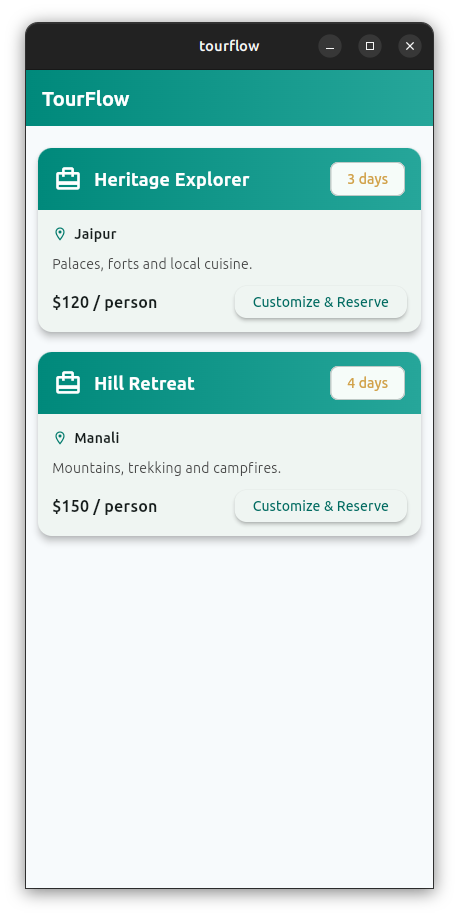
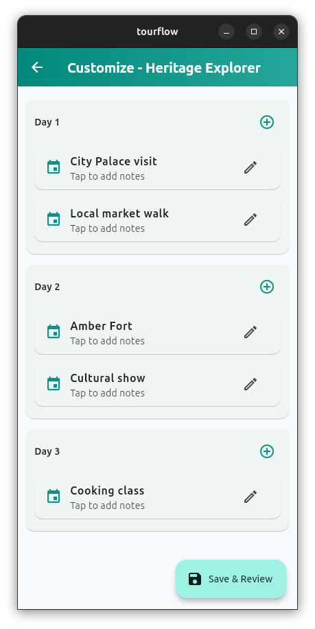
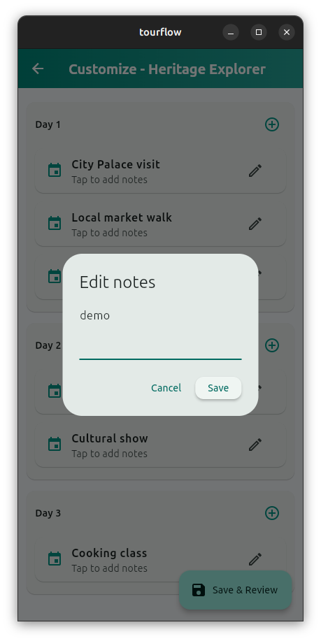
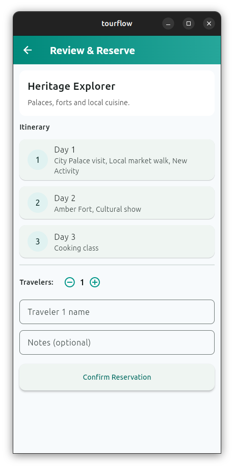
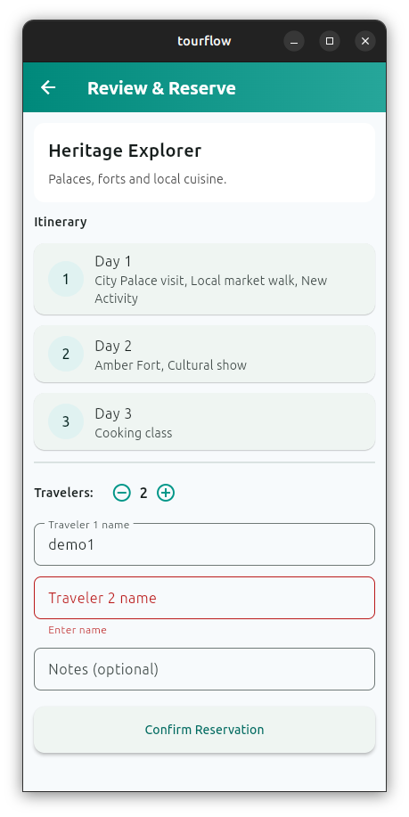
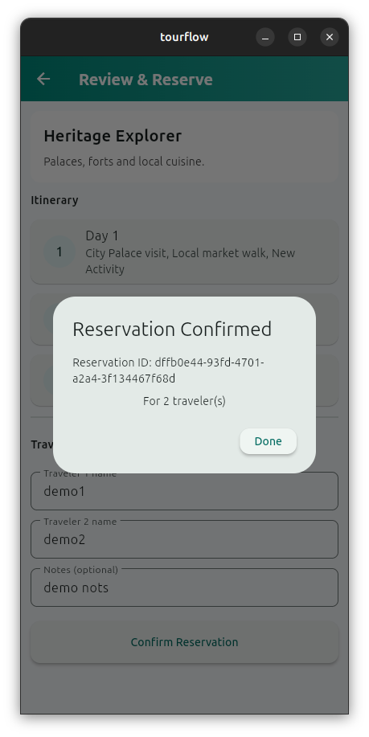

# 🏝️ Tourism Package Booking App

A Flutter application showcasing a **single workflow for booking tourism packages**, customizing itineraries, and reserving for single or group travelers.

This app demonstrates clean architecture using the **BLoC pattern**, follows **SOLID principles**, and includes **error handling**, **mock data**, **unit tests**, and an **aesthetic user interface** — all without login or API integration.

---
## 📱 App Demo

[](https://youtube.com/shorts/cpfrnRgToJs?feature=share)  
Click the image to watch the app demo on YouTube Shorts 🎥


---
## 🧭 App Workflow Preview

A visual flow of the Tourism Booking App 👇

| 🏠 Home (Select Trip) | | 🗺️ Customize Itinerary | | ✏️ Edit Activities |
|:--:|:--:|:--:|:--:|:--:|
|  | ➡️ |  | ➡️ |  |

| 🧾 Review & Reserve | | ⚠️ Validation / Error |  | ✅ Booking Confirmed |
|:--:|:--:|:--:|:--:|:--:|
|  | ➡️ |  | ➡️ |  |

---

## ✨ Features

- 🧳 **Browse Tourism Packages** — Select from preloaded mock travel packages.  
- 🗺️ **Customize Itinerary** — Add or remove destinations, activities, and travel days.  
- 👥 **Reserve for Single/Group** — Choose the number of travelers and confirm the booking.  
- ⚙️ **Error Handling** — Graceful fallback messages and retry options.  
- 🎨 **Modern UI Design** — Responsive, clean, and visually appealing Flutter widgets.  
- 🧩 **BLoC State Management** — Clean separation between UI and logic layers.  
- 🧪 **Unit Tests** — Covers booking logic and BLoC functionality.  
- 📦 **Offline Mock Data** — No API integration required.

---
## 🧱 Architecture

This project follows the BLoC (Business Logic Component) pattern for clean separation between:

- UI (View Layer)

- Business Logic (Bloc Layer)

- Data (Repository/Service Layer)

✅ SOLID Principles applied for maintainable and testable code.

✅ Error handling with graceful UI fallbacks.

---

## 📚 Dependencies

**flutter_bloc** – State management

**equatable** – Value equality for Bloc states

**mockito** – Unit testing mocks

**flutter_test** – For widget and bloc tests

---

## 🧱 Project Structure
```
tourflow/
├─ android/ ios/ web/ ...
├─ lib/
│  ├─ main.dart
│  ├─ app.dart
│  ├─ src/
│  │  ├─ models/
│  │  │  ├─ package_model.dart
│  │  │  ├─ itinerary_model.dart
│  │  │  └─ reservation_model.dart
│  │  ├─ repository/
│  │  │  └─ tour_repository.dart
│  │  ├─ bloc/
│  │  │  ├─ tour_event.dart
│  │  │  ├─ tour_state.dart
│  │  │  └─ tour_bloc.dart
│  │  ├─ ui/
│  │  │  ├─ screens/
│  │  │  │  ├─ package_list_screen.dart
│  │  │  │  ├─ customize_itinerary_screen.dart
│  │  │  │  └─ review_reserve_screen.dart
│  │  │  └─ widgets/
│  │  │     ├─ package_card.dart
│  │  │     └─ itinerary_editor.dart
│  │  └─ utils/
│  │     └─ validators.dart
├─ test/
│  ├─ bloc/tour_bloc_test.dart
│  └─ repository/tour_repository_test.dart
├─ pubspec.yaml
└─ README.md


```

---

## ⚙️ Setup & Run Instructions

### 1️⃣ Clone the repository
```bash
git clone https://github.com/<your-username>/tourflow.git
cd tourism_booking_app
```
### 2️⃣ Get dependencies
```bash
flutter pub get
```
### 3️⃣ Run the app
```bash
flutter run
```
### 4️⃣ Run unit tests
```bash
flutter test
```

